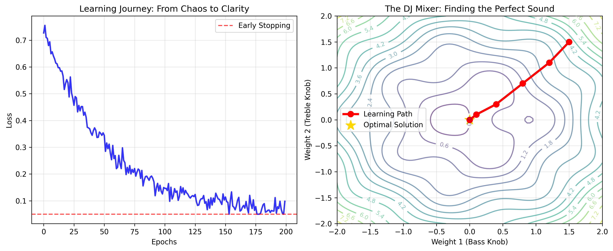

# What a One-Neuron Perceptron Taught Me About Gradient Descent

*How watching an AI learn to classify fruits revealed the beautiful mathematics of machine learning*

---

This week, I built a simple perceptron to classify fruits—apples vs. bananas—using just three features: length, weight, and "yellowness" score. What started as a basic coding exercise became a profound lesson in how artificial intelligence mirrors the fundamental way we all learn.

## The Humble Perceptron: AI's "Hello World"

A perceptron is machine learning stripped to its essence—a single artificial neuron that learns to make binary decisions. Feed it data, let it make mistakes, and watch it gradually improve. Simple? Yes. Boring? Absolutely not.

Here's what my fruit classifier looked like in code:

```python
# The learning heart of a perceptron
def train_step(features, targets, weights, bias, learning_rate):
    # Forward pass: make predictions
    predictions = sigmoid(np.dot(features, weights) + bias)
    
    # Calculate error
    error = predictions - targets
    
    # Backward pass: update weights
    weights -= learning_rate * np.dot(features.T, error) / len(targets)
    bias -= learning_rate * np.mean(error)
    
    return weights, bias
```

But the real magic happens in those weight updates. Each adjustment, guided by the gradient, is a step toward understanding.


*The learning journey: From chaotic loss to smooth convergence (left) and the path through parameter space like adjusting DJ knobs (right)*

## The DJ Mixer Analogy That Changed Everything

Imagine you're a DJ trying to get the perfect sound. You have three knobs—bass, treble, and volume—and an audience giving you instant feedback. Too much bass? They wince. Not enough volume? They can't hear. You make small adjustments, listen to the response, and adjust again.

This is exactly what gradient descent does. The "knobs" are your model weights, the "audience reaction" is your loss function, and those careful adjustments are your learning rate in action.

**The perceptron's journey:**
- **Random Start**: Weights initialized randomly (like randomly set DJ knobs)
- **Feedback Loop**: Error signals tell us which direction to adjust
- **Gradual Improvement**: Small steps prevent "overshooting" the optimal solution
- **Convergence**: Eventually, the system finds its groove

## When Learning Rate Becomes Your Best Friend (or Worst Enemy)

The learning rate—that humble hyperparameter—controls how big steps you take toward the solution. Set it too high, and you're like an overcaffeinated DJ wildly spinning knobs. Too low, and you'll take forever to find good sound.

In my fruit classifier:
- **LR = 0.1**: Smooth convergence in ~100 epochs
- **LR = 1.0**: Chaotic oscillations, never settling
- **LR = 0.001**: Painfully slow progress, like watching paint dry

The sweet spot? Just aggressive enough to make progress, just conservative enough to not overshoot. It's the Goldilocks principle of machine learning.

## The Moment of Artificial Enlightenment

The most fascinating part wasn't the final accuracy (though 100% felt pretty good). It was watching the loss curve descend—that smooth exponential decay from chaos to clarity. Each epoch, the model got a little bit "wiser" about what makes a banana a banana and an apple an apple.

**Initial predictions**: Random guesses (~50% accuracy)
**Final model**: Perfect classification with intuitive learned weights:
- Longer fruits → likely bananas
- Higher yellow scores → likely bananas  
- Weight became a subtle tie-breaker

The perceptron had developed "fruit intuition"—not through memorization, but through pattern recognition.

## Beyond Fruits: The Universal Learning Pattern

This simple experiment revealed something profound: artificial learning follows the same feedback-driven improvement cycle that governs everything from a child learning to ride a bike to a musician mastering an instrument.

**The universal pattern:**
1. Start with uncertainty (random weights/wobbly bike rides)
2. Receive feedback (error gradients/balance corrections)
3. Make small adjustments (weight updates/steering tweaks)
4. Repeat until mastery (convergence/confident riding)

## Why This Matters for AI's Future

Understanding gradient descent through a perceptron isn't just academic—it's the foundation of every neural network, from GPT to DALL-E. The same principles that taught my model to distinguish fruits are scaled up to:
- Language models learning word relationships
- Image classifiers recognizing faces
- Recommendation systems understanding preferences

Every breakthrough in AI is, fundamentally, gradient descent finding better ways to adjust digital "knobs" based on feedback.

## The Takeaway

Machine learning isn't magic—it's mathematics with a feedback loop. Whether you're training a perceptron to classify fruits or building the next foundation model, you're essentially helping a system learn to adjust its parameters in response to error signals.

The beauty lies not in the complexity of modern AI, but in the elegant simplicity of the underlying learning mechanism. Sometimes, the most profound insights come from the humblest beginnings—like a single artificial neuron learning to tell apples from bananas.

---

*Want to see the full implementation? Check out my [GitHub repository](https://github.com/assignment1/q3) with the complete perceptron code and fruit classification results.* 